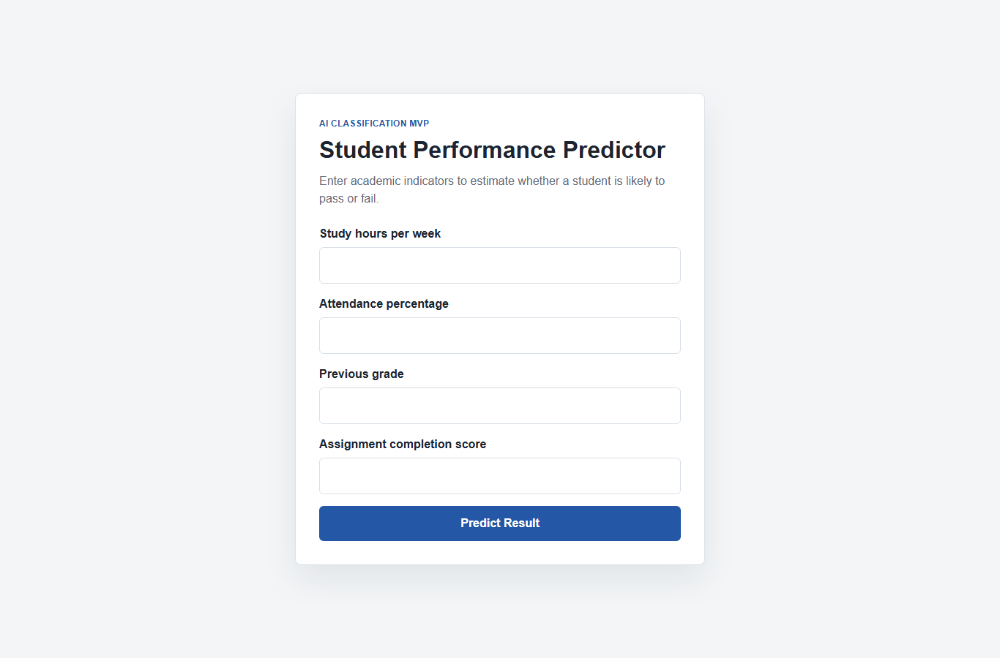
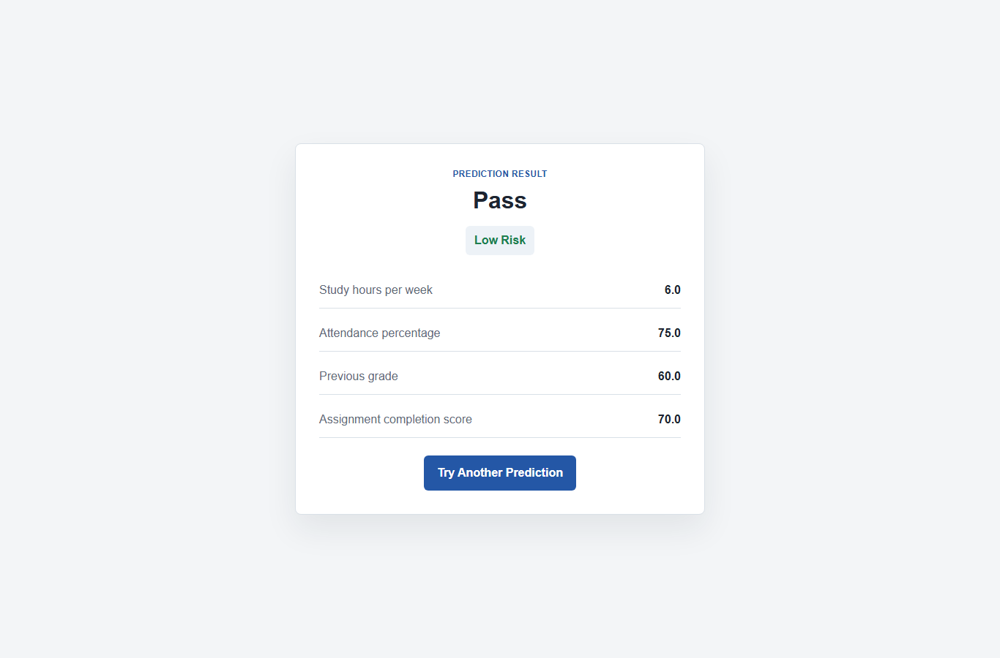

# Student Performance Predictor

## Project Description
A simple AI-based MVP web application that predicts whether a student is likely to pass or fail a course.

## Screenshots
### Home Page


### Pass Result


### Fail Result


## Problem Definition
The app helps identify students who may need academic support. It uses academic indicators such as weekly study hours, attendance, previous grade, and assignment completion score.

## AI Technique
This project uses classification with a Decision Tree Classifier from scikit-learn. The target output is categorical: Pass or Fail.

## Dataset
The project uses a mock student performance dataset named `student_data.csv`. It contains 40 student records with these columns:

- `student_id`
- `study_hours`
- `attendance`
- `previous_grade`
- `assignment_score`
- `result`

The mock data follows simple realistic assumptions: students with higher attendance, grades, study hours, and assignment scores are more likely to pass.

## Inputs and Outputs
Inputs:

- Study hours per week
- Attendance percentage
- Previous grade
- Assignment completion score

Outputs:

- Prediction: Pass or Fail
- Risk level: Low Risk, Medium Risk, or High Risk

## Database Design
The CSV file acts as simple data storage for the MVP. A SQL schema is also included in `database_schema.sql`.

```sql
CREATE TABLE students (
    student_id INTEGER PRIMARY KEY,
    study_hours REAL,
    attendance REAL,
    previous_grade REAL,
    assignment_score REAL,
    result TEXT
);
```

## How to Run
1. Install dependencies:

```bash
pip install -r requirements.txt
```

2. Run the app:

```bash
python app.py
```

3. Open in browser:

```text
http://127.0.0.1:5000
```

## How to Run with Docker
1. Build the Docker image:

```bash
docker build -t student-performance-predictor .
```

2. Run the container:

```bash
docker run --rm -p 5056:5000 student-performance-predictor
```

3. Open in browser:

```text
http://127.0.0.1:5056
```

## Testing Guide
See `APP_USAGE_AND_TEST_SCENARIOS.md` for step-by-step usage instructions, test scenarios, and expected outcomes.

## Report
See `REPORT_GR.md` for the Greek project report.

## AI Demonstration Script
The file `notebook/student_performance_ai.py` demonstrates the AI workflow:

- Import libraries
- Load dataset
- Check missing values
- Define features and target
- Split training and testing data
- Train the Decision Tree Classifier
- Calculate accuracy
- Show confusion matrix and classification report
- Run an example prediction

Run it from the `notebook` folder:

```bash
cd notebook
python student_performance_ai.py
```

## Project Structure
```text
student-performance-predictor/
|-- app.py
|-- model.py
|-- student_data.csv
|-- database_schema.sql
|-- requirements.txt
|-- README.md
|-- REPORT_GR.md
|-- APP_USAGE_AND_TEST_SCENARIOS.md
|-- Dockerfile
|-- .dockerignore
|-- templates/
|   |-- index.html
|   `-- result.html
|-- static/
|   `-- style.css
|-- docs/
|   `-- screenshots/
|       |-- 01-home.png
|       |-- 02-pass-result.png
|       `-- 03-fail-result.png
`-- notebook/
    `-- student_performance_ai.py
```

## GitHub Preparation
Suggested commands:

```bash
git init
git add .
git commit -m "Initial student performance predictor MVP"
git branch -M main
git remote add origin <your-github-repository-url>
git push -u origin main
```

## Future Improvements
- Use a larger real dataset.
- Improve model accuracy with more features.
- Add user login.
- Store predictions in a real database.
- Add visual analytics dashboard.

## Use of Generative AI
Generative AI was used to support planning, structuring, and explanation of the project. Final implementation and evaluation should be reviewed by the student.
